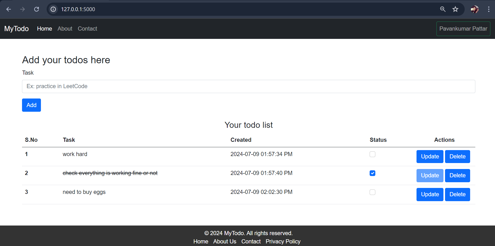
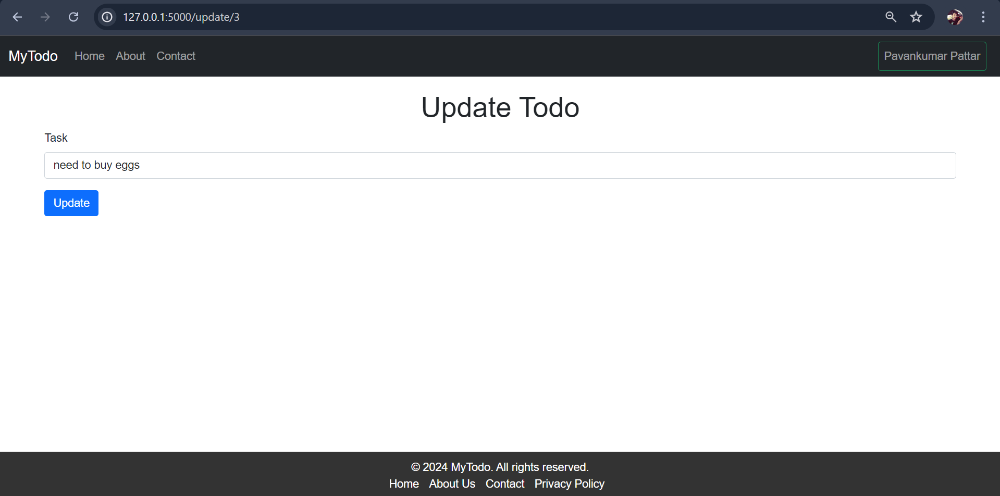
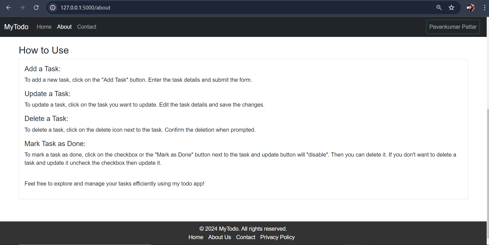

# MyTodo

A simple Flask-based Todo application for managing tasks. Add, update, delete, mark as done, and list todos conveniently. This is a straightforward Todo application designed for managing tasks efficiently. It provides essential features to help users organize their daily activities.

## Table of Contents

- [Overview](#overview)
- [Features](#features)
- [Screenshots](#Screenshots)
- [Requirements](#requirements)
- [Getting Started](#getting-started)
  - [Installation](#installation)
  - [Usage](#usage)
- [Project Structure](#project-structure)
- [Contributing](#contributing)
- [Guidelines](#Guidelines)
- [License](#license)

## Overview

This user-friendly application, built with Flask and Bootstrap, can be customized to fit your needs. You can easily edit and adapt it for your own projects. Feel free to explore and make it your own. If you have any questions or would like to collaborate, contact me.
This is a straightforward Todo application designed for managing tasks efficiently. It provides essential features to help users organize their daily activities.

## Features

- Add Todo: Easily add new tasks to your list.
- Update Todo: Edit existing tasks as needed.
- Delete Todo: Remove tasks that are no longer needed.
- Mark as Done: Mark tasks as completed.
- List Todos: View all tasks in a list format for quick reference.

## Screenshots

- Add Todo


- Update Todo


- How to use


## Requirements

- List dependencies and requirements needed to run the project is defined in requirements file.
- Use below instructions for setting up a development environment.

## Getting Started

### Installation

1. Clone the repository:
   ```bash
   git clone https://github.com/Pavankumar1299/MyTodo.git
   cd MyTodo
   ```

2. Set up a virtual environment (optional but recommended):
   ```bash
   python -m venv venv
   source venv/bin/activate  # On Windows use `venv\Scripts\activate`
   ```

3. Install dependencies:
   ```bash
   pip install -r requirements.txt
   ```

### Usage

1. Set any necessary environment variables: (optional but recommended when you create your new db)
   ```bash
   flask db init
   flask db migrate
   flask db update
   ```

2. Run the application:
 
   ```bash
   python run.py
   ```

3. Access the application in a web browser at `http://localhost:5000`

## Contributing

Contributions are welcome! Here's how you can contribute to improve the project:

1. Fork the repository and clone it locally.
    ```bash
    git clone https://github.com/Pavankumar1299/MyTodo.git
    cd MyTodo
    ```

2. Create a new branch for your feature or bug fix.
    ```bash
    git checkout -b feature/your-feature-name
    ```

3. Make changes and test thoroughly.

4. Commit your changes.
    ```bash
    git commit -am 'Add some feature or fix'
    ```

5. Push to your branch on GitHub.
    ```bash
    git push origin feature/your-feature-name
    ```

6. Submit a pull request detailing your changes and why they should be included.

7. Discuss and review your pull request with project maintainers.

8. After approval, your changes will be merged into the main repository.

## Guidelines
- Follow the coding style and conventions used in the project.
- Maintain clear and concise commit messages.
- Ensure all changes are properly tested.
- Help us maintain a friendly and inclusive community.


## License

This project is licensed under the MIT License - see the [LICENSE](LICENSE) file for details.
